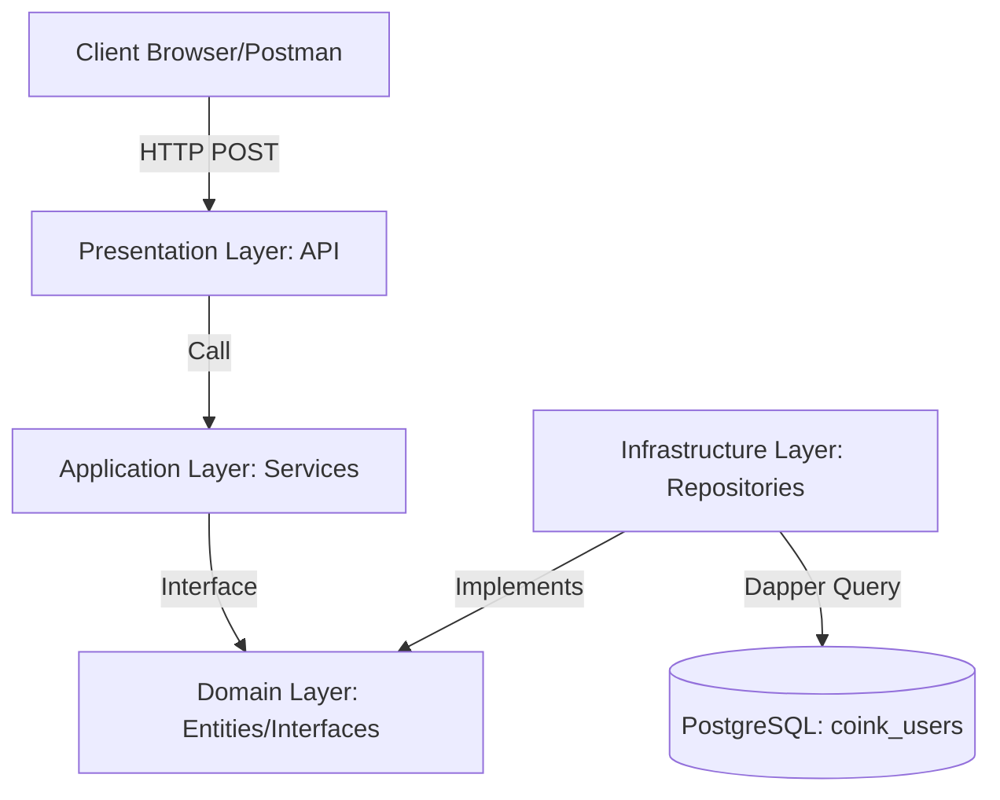
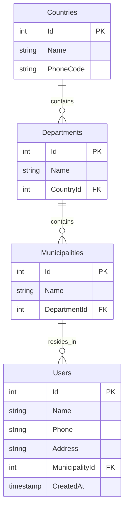
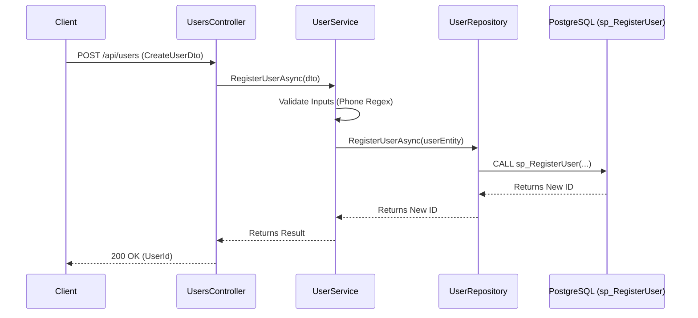

# Technical Architecture - Coink User Management API

This document contains the detailed technical documentation regarding the architecture, design, and structure of the solution.

---

## 📐 System Architecture

### Container Diagram (C4)

The system follows the principles of **Clean Architecture**, ensuring that the business logic remains independent from the database and external frameworks.



### Architecture Layers

The solution is organized into the following layers:

1. **Presentation Layer (UserManagement.API)**
   - REST Controllers
   - Middlewares (Error Handling, Logging)
   - Application Configuration
   - Swagger/OpenAPI

2. **Application Layer (UserManagement.Application)**
   - Business Services
   - DTOs (Data Transfer Objects)
   - Business Validations
   - Response Wrappers

3. **Domain Layer (UserManagement.Domain)**
   - Domain Entities
   - Interfaces (Contracts)
   - Domain Exceptions

4. **Infrastructure Layer (UserManagement.Infrastructure)**
   - Repositories (Interface Implementations)
   - Data Access (Dapper)
   - Database Configuration

---

## 🗄️ Database Design

### Entity-Relationship Diagram (ERD)

The database is normalized to preserve the integrity of the geographical hierarchy.



### Tables

#### Countries
- **Id**: INT (Identity, Primary Key)
- **Name**: VARCHAR(100) NOT NULL (Unique)
- **PhoneCode**: VARCHAR(10) NOT NULL

#### Departments
- **Id**: INT (Identity, Primary Key)
- **Name**: VARCHAR(100) NOT NULL
- **CountryId**: INT NOT NULL (Foreign Key → Countries)
- Constraint: Unique(Name, CountryId)

#### Municipalities
- **Id**: INT (Identity, Primary Key)
- **Name**: VARCHAR(100) NOT NULL
- **DepartmentId**: INT NOT NULL (Foreign Key → Departments)

#### Users
- **Id**: INT (Identity, Primary Key)
- **Name**: VARCHAR(150) NOT NULL
- **Phone**: VARCHAR(20) NOT NULL
- **Address**: VARCHAR(250) NOT NULL
- **MunicipalityId**: INT NOT NULL (Foreign Key → Municipalities)
- **CreatedAt**: TIMESTAMP (Default: CURRENT_TIMESTAMP)

### Stored Procedures

The solution uses PostgreSQL stored procedures for all database operations:

- **sp_RegisterUser**: Registers a new user and returns the newly created ID.
- **sp_GetAllUsers**: Retrieves all users along with their geographical information.
- **sp_GetUserById**: Retrieves a user by ID.
- **sp_UpdateUser**: Updates an existing user's information.
- **sp_DeleteUser**: Deletes a user.

---

## 🔄 Process Flows

### Sequence Diagram - User Registration

This flow illustrates how information travels from the client to the PostgreSQL stored procedure.



---

## 🛠️ Technologies Used

### Backend
- **.NET 8**: Primary framework
- **ASP.NET Core**: Web framework
- **Dapper**: Lightweight ORM for data access
- **Npgsql**: PostgreSQL driver for .NET
- **Serilog**: Structured logging
- **Swashbuckle (Swagger)**: API documentation

### Database
- **PostgreSQL 18**: Relational Database Management System (RDBMS)

### Testing
- **xUnit**: Unit testing framework
- **Moq**: Mocking framework

### DevOps
- **Docker**: Containerization
- **Docker Compose**: Container orchestration

---

## 📦 Project Structure

```text
UserManagement.sln
├── UserManagement.API/              # Presentation Layer
│   ├── Controllers/
│   ├── Middlewares/
│   └── Program.cs
├── UserManagement.Application/      # Application Layer
│   ├── DTOs/
│   ├── Services/
│   └── Wrappers/
├── UserManagement.Domain/           # Domain Layer
│   ├── Entities/
│   ├── Interfaces/
│   └── Exceptions/
├── UserManagement.Infrastructure/   # Infrastructure Layer
│   └── Repositories/
└── UserManagement.Tests/            # Unit Tests
    └── Services/
```

---

## 🔐 Validations and Business Rules

### Input Validations

1. **Name**: Cannot be empty.
2. **Phone**: Must follow the international numeric format (7 to 15 digits).
3. **Address**: Cannot be empty.
4. **MunicipalityId**: Must exist in the database (validated by the stored procedure).

### Business Rules

- Phone number format validation is performed in the Application layer.
- The existence of `MunicipalityId` is validated by the stored procedure.
- All database operations are executed through stored procedures.
- Structured logging captures all significant operations.

---

## 📝 Additional Notes

- The solution implements **Clean Architecture** to ensure a clear separation of concerns.
- Data access uses **Dapper** to achieve better performance compared to Entity Framework Core.
- **Stored procedures** encapsulate all database logic.
- **Structured logging** simplifies monitoring and debugging in production environments.
- The system is designed to support horizontal scaling using Docker.