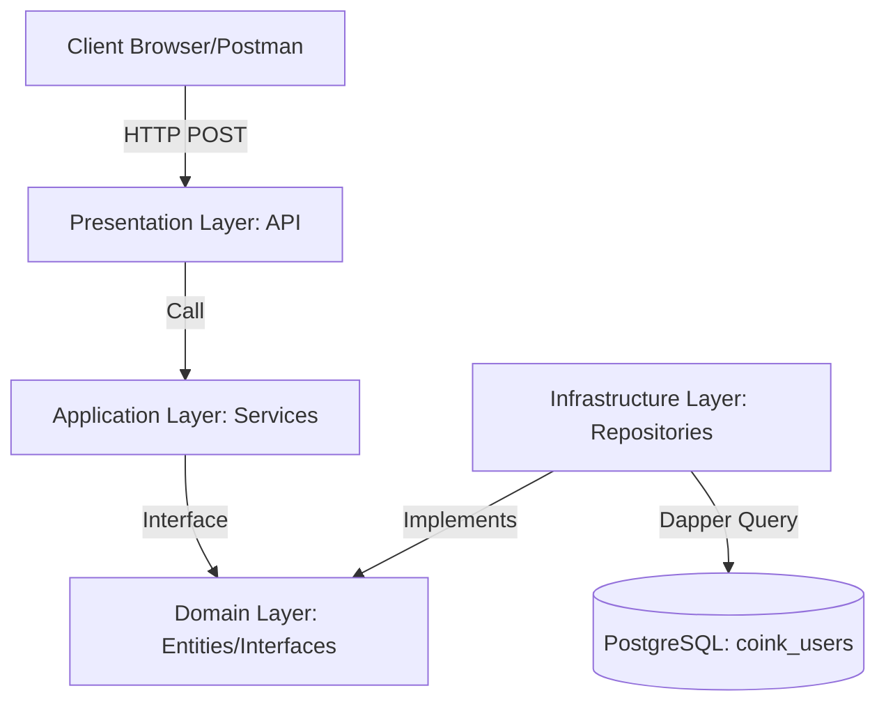
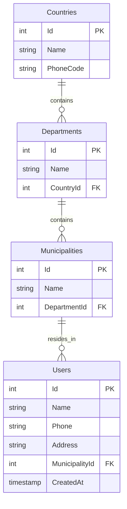
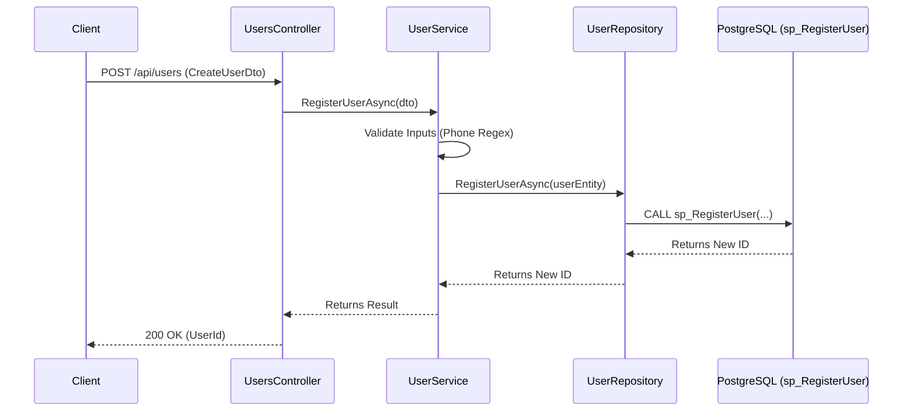

# Arquitectura Técnica - Coink User Management API

Este documento contiene la documentación técnica detallada sobre la arquitectura, diseño y estructura de la solución.

---

## 📐 Arquitectura del Sistema

### Diagrama de Contenedores (C4)

El sistema sigue los principios de **Clean Architecture**, asegurando que la lógica de negocio no dependa de la base de datos o de los frameworks externos.



### Capas de la Arquitectura

La solución está organizada en las siguientes capas:

1. **Presentation Layer (UserManagement.API)**
   - Controladores REST
   - Middlewares (Manejo de errores, logging)
   - Configuración de la aplicación
   - Swagger/OpenAPI

2. **Application Layer (UserManagement.Application)**
   - Servicios de negocio
   - DTOs (Data Transfer Objects)
   - Validaciones de negocio
   - Wrappers de respuesta

3. **Domain Layer (UserManagement.Domain)**
   - Entidades de dominio
   - Interfaces (contratos)
   - Excepciones de dominio

4. **Infrastructure Layer (UserManagement.Infrastructure)**
   - Repositorios (implementación de interfaces)
   - Acceso a datos (Dapper)
   - Configuración de base de datos

---

## 🗄️ Diseño de Base de Datos

### Diagrama Entidad-Relación (ERD)

La base de datos está normalizada para mantener la integridad de la jerarquía geográfica.



### Tablas

#### Countries
- **Id**: INT (Identity, Primary Key)
- **Name**: VARCHAR(100) NOT NULL (Unique)
- **PhoneCode**: VARCHAR(10) NOT NULL

#### Departments
- **Id**: INT (Identity, Primary Key)
- **Name**: VARCHAR(100) NOT NULL
- **CountryId**: INT NOT NULL (Foreign Key → Countries)
- Constraint: Unique(Name, CountryId)

#### Municipalities
- **Id**: INT (Identity, Primary Key)
- **Name**: VARCHAR(100) NOT NULL
- **DepartmentId**: INT NOT NULL (Foreign Key → Departments)

#### Users
- **Id**: INT (Identity, Primary Key)
- **Name**: VARCHAR(150) NOT NULL
- **Phone**: VARCHAR(20) NOT NULL
- **Address**: VARCHAR(250) NOT NULL
- **MunicipalityId**: INT NOT NULL (Foreign Key → Municipalities)
- **CreatedAt**: TIMESTAMP (Default: CURRENT_TIMESTAMP)

### Stored Procedures

La solución utiliza stored procedures de PostgreSQL para las operaciones de base de datos:

- **sp_RegisterUser**: Registra un nuevo usuario y retorna su ID
- **sp_GetAllUsers**: Obtiene todos los usuarios con información geográfica
- **sp_GetUserById**: Obtiene un usuario por su ID
- **sp_UpdateUser**: Actualiza la información de un usuario
- **sp_DeleteUser**: Elimina un usuario

---

## 🔄 Flujos de Proceso

### Diagrama de Secuencia - Registro de Usuario

Este flujo detalla cómo viaja la información desde el cliente hasta el procedimiento almacenado en PostgreSQL.



---

## 🛠️ Tecnologías Utilizadas

### Backend
- **.NET 8**: Framework principal
- **ASP.NET Core**: Framework web
- **Dapper**: ORM ligero para acceso a datos
- **Npgsql**: Driver de PostgreSQL para .NET
- **Serilog**: Logging estructurado
- **Swashbuckle (Swagger)**: Documentación de API

### Base de Datos
- **PostgreSQL 18**: Sistema de gestión de bases de datos relacional

### Testing
- **xUnit**: Framework de pruebas unitarias
- **Moq**: Framework de mocking

### DevOps
- **Docker**: Containerización
- **Docker Compose**: Orquestación de contenedores

---

## 📦 Estructura del Proyecto

```
UserManagement.sln
├── UserManagement.API/              # Capa de presentación
│   ├── Controllers/
│   ├── Middlewares/
│   └── Program.cs
├── UserManagement.Application/      # Capa de aplicación
│   ├── DTOs/
│   ├── Services/
│   └── Wrappers/
├── UserManagement.Domain/           # Capa de dominio
│   ├── Entities/
│   ├── Interfaces/
│   └── Exceptions/
├── UserManagement.Infrastructure/   # Capa de infraestructura
│   └── Repositories/
└── UserManagement.Tests/            # Pruebas unitarias
    └── Services/
```

---

## 🔐 Validaciones y Reglas de Negocio

### Validaciones de Entrada

1. **Nombre**: No puede estar vacío
2. **Teléfono**: Debe cumplir formato numérico internacional (7 a 15 dígitos)
3. **Dirección**: No puede estar vacía
4. **MunicipalityId**: Debe existir en la base de datos (validado por stored procedure)

### Reglas de Negocio

- La validación de formato de teléfono se realiza en la capa de aplicación
- La existencia de `MunicipalityId` se valida en el stored procedure
- Todas las operaciones de base de datos se realizan mediante stored procedures
- El logging estructurado captura todas las operaciones importantes

---

## 📝 Notas Adicionales

- La solución implementa **Clean Architecture** para mantener la separación de responsabilidades
- El acceso a datos utiliza **Dapper** para mejor rendimiento comparado con EF Core
- Los **stored procedures** encapsulan la lógica de base de datos
- El **logging estructurado** facilita el monitoreo y debugging en producción
- El sistema está preparado para escalar horizontalmente usando Docker
