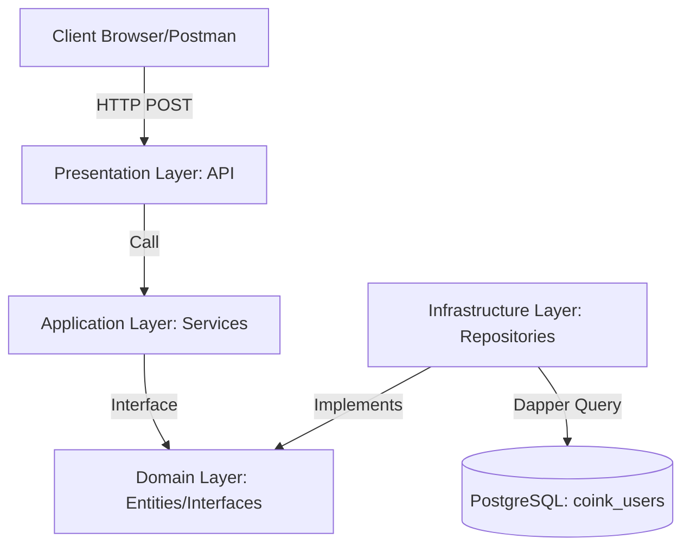
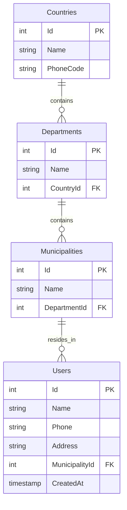
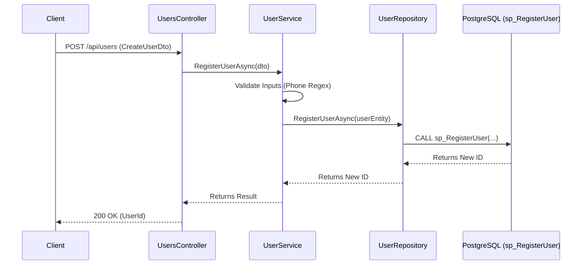

# Coink User Management API

[](https://dotnet.microsoft.com/download/dotnet/8.0)
[](https://www.postgresql.org/)
[]()

Esta es una solución robusta y escalable desarrollada en **.NET 8** que implementa una arquitectura limpia (**Clean Architecture**) para la gestión y registro de usuarios con una estructura geográfica jerárquica (País, Departamento, Municipio).

---

## 🛠️ Guía de Configuración e Instalación

Siga estos pasos para configurar el entorno y ejecutar la solución en una máquina local.

### 1. Prerrequisitos
* **.NET 8 SDK** instalado.
* **PostgreSQL 18** o superior en ejecución.
* Un IDE de su preferencia (Visual Studio, VS Code o JetBrains Rider).

### 2. Inicialización de la Base de Datos
1. Abra su cliente de PostgreSQL (pgAdmin, DBeaver, etc.).
2. Cree una base de datos con el nombre: `coink_users`.
3. Ejecute los scripts SQL en el siguiente orden para asegurar la integridad de las llaves foráneas:
   * **Paso 1 (DDL):** Ejecute el script de creación de tablas (`Countries`, `Departments`, `Municipalities`, `Users`).
   * **Paso 2 (Functions):** Ejecute el script que crea el Stored Procedure `sp_RegisterUser`.
   * **Paso 3 (DML Seeding):** Ejecute el script de inserción de datos maestros para poblar la jerarquía geográfica.

### 3. Configuración de la API
Localice el archivo `appsettings.json` en el proyecto **UserManagement.API** y actualice la cadena de conexión con sus credenciales locales:

```json
"ConnectionStrings": {
  "DefaultConnection": "Host=localhost;Port=5432;Database=coink_users;Username=postgres;Password=TU_PASSWORD"
}
```
### 4. Ejecución
Desde una terminal situada en la raíz de la solución, ejecute los siguientes comandos para poner en marcha el sistema:

```bash
# 1. Restaurar las dependencias de NuGet en todos los proyectos
dotnet restore

# 2. Compilar la solución para verificar que no existan errores
dotnet build

# 3. Iniciar el proyecto de la API
dotnet run --project UserManagement.API

```

Una vez ejecutada, la API estará disponible y podrá acceder a la interfaz interactiva de Swagger en la siguiente URL para realizar pruebas: https://localhost:5001/swagger/index.html (o el puerto que le asigne su terminal).

### 📐 Arquitectura Técnica
Diagrama de Contenedores (C4)
El sistema sigue los principios de Clean Architecture, asegurando que la lógica de negocio no dependa de la base de datos o de los frameworks externos.


 #### Diagrama Entidad-Relación (ERD)
La base de datos está normalizada para mantener la integridad de la jerarquía geográfica.

#### Diagrama de Secuencia de Registro
Este flujo detalla cómo viaja la información desde el cliente hasta el procedimiento almacenado en PostgreSQL.


### 🛡️ Documentación de Endpoints
Registro de Usuario
* URL: /api/users
* Método: POST
* Cuerpo (JSON):
```json
{
  "name": "John Doe",
  "phone": "+573001234567",
  "address": "Calle 123 # 45-67",
  "countryId": 1,
  "departmentId": 1,
  "municipalityId": 1
}
```
### Validaciones: El sistema verifica que el nombre y la dirección no estén vacíos, y que el teléfono cumpla con un formato numérico internacional válido (7 a 15 dígitos).